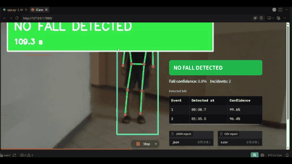

# ICare — Pose-Based Fall Detection

ICare is a portfolio research prototype for detecting falls from a live webcam or recorded video. It uses person detection, pose estimation, and a temporal action-recognition model instead of classifying isolated RGB frames.

> **Safety:** This is not a medical device, emergency service, or production monitoring system. Do not perform real falls on a hard surface when testing.

## Demo video

[](demo_videos/Fall_Detection.mp4)

Click the animated preview to open the original MP4.

This short video is included only to demonstrate the **Upload video** workflow. It is not automatically added to the training dataset and was not used to calculate the evaluation results below.

## Pipeline

```text
Camera/video frame
  -> YOLOX-tiny person bounding box
  -> RTMPose-s COCO-17 keypoints
  -> timestamped rolling pose buffer
  -> resample to 48 temporal positions
  -> 17 x 48 x 64 x 64 joint heatmaps
  -> fine-tuned PoseC3D ONNX model
  -> P(No Fall), P(Fall)
  -> threshold and incident de-duplication
  -> on-screen result plus JSON/CSV report
```

YOLOX is used only to locate the person. RTMPose estimates the 17 COCO body joints. PoseC3D analyzes their movement over time.

## Model and dataset

The binary PoseC3D model was fine-tuned from an NTU60-pretrained SlowOnly-R50 PoseC3D checkpoint using MMAction2. The source dataset contained paired videos and pose CSVs under `Fall` and `No_Fall`:

| Audit stage | Samples |
|---|---:|
| Original fall pairs | 3,140 |
| Original no-fall pairs | 3,848 |
| Original total | 6,988 |
| Empty CSVs removed | 29 |
| Final samples after exact-pose deduplication | 6,766 |
| Final fall samples | 3,059 |
| Final no-fall samples | 3,707 |
| Unique derived groups | 4,786 |

The source dataset is not stored in this GitHub repository because it contains thousands of videos and must be obtained under its original distribution terms. The validation notebook expects the following structure:

```text
Fall/
  Raw_Video/
  Keypoints_CSV/
No_Fall/
  Raw_Video/
  Keypoints_CSV/
```

Each training video must have a matching, frame-aligned COCO-17 keypoint CSV. Supported dataset video extensions are `.mp4`, `.avi`, `.mov`, `.mkv`, `.mpeg`, `.mpg`, and `.m4v`. Adding a video to `demo_videos/` or analyzing it in the app does not retrain the model; new training samples must be validated, included in regenerated metadata, and used in a new training run.

The group-aware split contained 4,742 training, 1,013 validation, and 1,011 test samples. It prevents derived duplicates/groups from crossing splits. Reliable subject IDs were not available, so this result must not be described as a true subject-independent evaluation.

### Held-out test results

The reported evaluation used a classification threshold of `P(Fall) >= 0.50`:

| Metric | Result |
|---|---:|
| Fall precision | 97.09% |
| Fall recall | 94.75% |
| Fall F1 | 95.90% |
| Balanced accuracy | 96.20% |
| PR-AUC / average precision | 99.61% |
| Overall accuracy | 96.34% |

Confusion counts were TN=541, FP=13, FN=24, and TP=433. A threshold of `0.4039` produced the highest observed F1 during a separate test-set analysis, but it is **analysis only** and is not used for deployment because selecting a threshold on test labels would bias the result. Final calibration should use validation data.

The exported ONNX model accepts `batch x 17 x 48 x 64 x 64` float heatmaps and returns `batch x 2` class probabilities. PyTorch/ONNX verification produced a maximum difference of approximately `2.8e-22`.

## Current live inference behavior

- Browser capture target: 640x360 at up to 12 FPS.
- FastRTC skips stale frames.
- A background worker retains only the newest pending frame; it never builds a latency-producing frame queue.
- Inference frames are resized to a maximum width of 416 pixels.
- YOLOX-tiny runs every third processed pose frame, with bounding-box reuse on the two frames between detections. It also runs immediately when no box exists.
- RTMPose-s runs for every frame accepted by the pose worker.
- The buffer retains up to four seconds of timestamped poses.
- Startup requires six successful poses spanning at least two seconds.
- Available poses are interpolated to the model's fixed 48-position input.
- PoseC3D runs at most once every 0.75 seconds (about 1.33 predictions/second).
- The live overlay displays pose-buffer count/coverage or an inference error while diagnosing a prolonged `PREPARING` state.

The central real-time design rule is to **drop stale frames instead of allowing latency to accumulate**. On a CPU, the camera can capture at 12 FPS while pose inference runs at a lower rate and still remain close to the current moment.

### Incident rule

A new incident is recorded immediately when one temporal PoseC3D prediction reaches:

```text
P(Fall) >= 0.50
```

Each report records only the incident number, detection timestamp, confidence, source, and UTC creation time. It does not claim a fall start, end, or duration.

After an incident, the detector is re-armed only after three predictions below `0.35`. This prevents overlapping four-second windows from recording the same physical fall repeatedly; the clear threshold is an internal de-duplication rule, not a reported fall-ending time.

## Repository structure

```text
app.py                              Gradio/FastRTC local interface
icare_app/inference.py              probability and incident logic
icare_app/pose.py                   YOLOX + RTMPose latest-frame worker
icare_app/posec3d_bridge.py         temporal resampling and heatmaps
icare_app/onnx_backend.py           PoseC3D ONNX Runtime backend
icare_app/reports.py                JSON/CSV report generation
models/posec3d_fall.onnx            deployable fine-tuned model
models/posec3d_runtime.json         model preprocessing metadata
fall_video_dataset_validation.ipynb dataset audit and cleaning
posec3d_finetune_kaggle.ipynb       training, evaluation, and ONNX export
```

Generated reports are written to `artifacts/reports/` and excluded from Git. Training checkpoints (`.pth`, `.pt`, `.ckpt`), environments, caches, and local test media are also ignored. The deployable ONNX model remains versioned.

## Run locally

Python 3.11 is the tested local version.

```powershell
cd C:\Users\vihaa\Desktop\Voxela\ICare
conda activate icare
python -m pip install -r requirements.txt
python app.py
```

Open [http://127.0.0.1:7860](http://127.0.0.1:7860) and grant camera permission. The first run downloads and caches the YOLOX-tiny and RTMPose-s ONNX weights.

The application automatically loads `models/posec3d_fall.onnx`. To reduce CPU work, lower the inference width before starting:

```powershell
$env:ICARE_INFERENCE_WIDTH="320"
python app.py
```

If port 7860 is already occupied, stop the earlier process or use another port:

```powershell
$env:GRADIO_SERVER_PORT="7861"
python app.py
```

## Safe testing

Use prerecorded fall videos first. For live tests, keep the full body and landing area visible, use good lighting, and prefer a side or 45-degree camera angle. Only perform a controlled descent onto a thick mattress with another person present—never stage an uncontrolled fall.

Test hard negatives as well as falls:

- fast sitting;
- normal lying down;
- crouching;
- picking up an object;
- tying a shoe;
- leaving the frame;
- camera movement or occlusion.

Record live probabilities and expected outcomes before changing thresholds. Production threshold calibration must use validation recordings from the complete runtime pipeline, not the held-out test set.

## Limitations and next steps

- The current pipeline follows only the largest detected person.
- CPU pose throughput can be much lower than camera FPS.
- Live RTMPose poses may differ from the pose generator used for the dataset, creating a train/deployment domain gap.
- The custom ONNX preprocessing bridge should be compared against MMAction2 on real validation samples for exact parity.
- The reported split is group-aware, not confirmed subject-independent.
- A production system requires subject-independent and environment-diverse evaluation, validation-based threshold calibration, multi-person identity tracking, alert delivery, privacy/security controls, and substantially more failure-mode testing.
